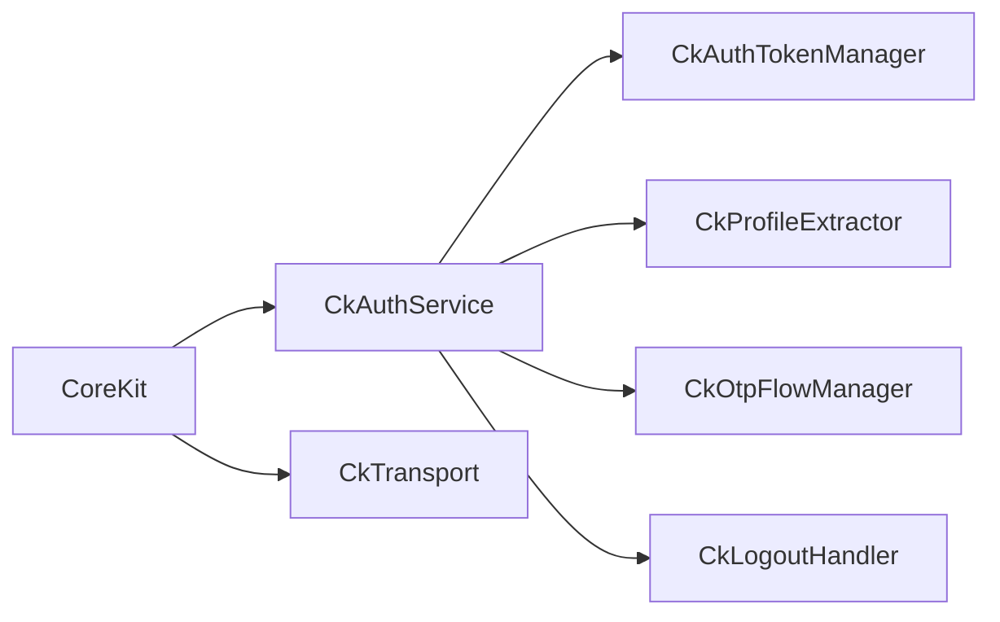

# CoreKit

[](https://github.com/kmmuzahid/flutter_core_kit/releases)

**CoreKit** (`core_kit`) is a Flutter package that bundles production-oriented UI widgets, responsive layout helpers, Dio-based networking with token refresh, secure storage, and an optional authentication module. Import everything from a single entry point:

```dart
import 'package:core_kit/core_kit.dart';
```

Public APIs use the **`Ck` prefix** (for example `CkButton`, `CkText`, `CkTransport`).

---

## Table of Contents

1. [Features](#features)
2. [Installation](#installation)
3. [Quick Start](#quick-start)
4. [Configuration](#configuration)
5. [Navigation & Global Access](#navigation--global-access)
6. [UI Components](#ui-components)
7. [Forms & Validation](#forms--validation)
8. [Dialogs & Overlays](#dialogs--overlays)
9. [Responsive Utilities](#responsive-utilities)
10. [Transport (HTTP)](#transport-http)
11. [Storage](#storage)
12. [Authentication Module](#authentication-module)
13. [Location Pickers](#location-pickers)
14. [Utilities & Extensions](#utilities--extensions)
15. [License](#license)

---

## Features

| Area | Highlights |
|------|------------|
| **Bootstrap** | `CoreKit` / `CoreKit.router` / `CoreKit.builder` — initializes Dio, screen scaling, optional auth |
| **UI** | Buttons, text fields, dropdowns, images, lists/grids with pagination, tabs, rating, app bar |
| **Layout** | `.w`, `.h`, `.sp`, `.r` scaling from a design size (default 428×926) |
| **Transport** | `CkTransport` + `CkResponse`, automatic token refresh, retries |
| **Storage** | `CkStorage` — secure storage with SharedPreferences fallback |
| **Auth** | `CkAuthService`, OTP flows, social login hooks, profile caching, declarative auto-navigation |

---

## Installation

### 1. Latest release tag

[](https://github.com/kmmuzahid/flutter_core_kit/releases)

```bash
# macOS / Linux / Git Bash
git ls-remote --tags --refs --sort='v:refname' https://github.com/kmmuzahid/flutter_core_kit.git | tail -n1 | awk -F/ '{print $3}'

# Windows (PowerShell)
(git ls-remote --tags --refs --sort='v:refname' https://github.com/kmmuzahid/flutter_core_kit.git | Select-Object -Last 1) -split '/' | Select-Object -Last 1
```

### 2. `pubspec.yaml`

```yaml
dependencies:
  core_kit:
    git:
      url: https://github.com/kmmuzahid/flutter_core_kit.git
      ref: <LATEST_VERSION_TAG>  # e.g. 0.0.1
```

```bash
flutter pub get
```

**Requirements:** Dart SDK `^3.12.0`, Flutter SDK compatible with your app.

---

## Quick Start

`CoreKit` requires a **`GlobalKey<NavigatorState>`** and a **`CoreKitConfig`**. It wraps `MaterialApp`, runs initialization (Dio, screen utils, optional auth), and shows `preInitChild` until ready.

### Minimal app (Navigator 1.0)

```dart
import 'package:core_kit/core_kit.dart';
import 'package:flutter/material.dart';

final _navigatorKey = GlobalKey<NavigatorState>();

void main() {
  runApp(
    CoreKit(
      navigatorKey: _navigatorKey,
      config: CkConfigImpl(),
      title: 'My App',
      theme: ThemeData(
        colorScheme: ColorScheme.fromSeed(seedColor: Colors.blue),
        useMaterial3: true,
      ),
      home: const HomeScreen(),
    ),
  );
}

/// Minimal config — only required overrides. See [Configuration](#configuration) for every option.
class CkConfigImpl extends CoreKitConfig with CoreKitConfigDefaults {
  @override
  String get imageBaseUrl => 'https://cdn.example.com/';

  @override
  CkTransportConfig get ckTransportConfig => CkTransportConfig(
        baseUrl: 'https://api.example.com',
        refreshTokenEndpoint: '/auth/refresh',
      );
}

class HomeScreen extends StatelessWidget {
  const HomeScreen({super.key});

  @override
  Widget build(BuildContext context) {
    return Scaffold(
      appBar: CkAppBar(title: 'Home'),
      body: Center(
        child: CkButton(
          titleText: 'Hello',
          onTap: () => CkSnackBar(
            'CoreKit is ready',
            type: CkSnackBarType.success,
          ),
        ),
      ),
    );
  }
}
```

### GoRouter / declarative routing

```dart
void main() {
  final router = GoRouter(
    navigatorKey: _navigatorKey,
    routes: [/* ... */],
  );

  runApp(
    CoreKit.router(
      navigatorKey: _navigatorKey,
      config: CkConfigImpl(),
      routerConfig: router,
      title: 'My App',
      theme: ThemeData(useMaterial3: true),
    ),
  );
}
```

### Custom `MaterialApp` via builder

```dart
CoreKit.builder(
  navigatorKey: _navigatorKey,
  config: CkConfigImpl(),
  app: (buildChild) => MaterialApp(
    navigatorKey: _navigatorKey,
    builder: buildChild,
    home: const HomeScreen(),
  ),
);
```

---

## Configuration

Implement **`CoreKitConfig`** and mix in **`CoreKitConfigDefaults`** for sensible defaults on optional members. Pass your implementation to `CoreKit` as `config: CkConfigImpl()`.

### `CoreKitConfig` members

| Override | Required | Default (with `CoreKitConfigDefaults`) | Purpose |
|----------|----------|----------------------------------------|---------|
| `imageBaseUrl` | **Yes** | — | Base URL for `CkImage` relative paths |
| `ckTransportConfig` | **Yes** | — | API base URL, timeouts, token refresh |
| `designSize` | No | `Size(428, 926)` | Responsive scaling reference |
| `authConfig` | No | `null` | Enables `CkAuthService` — tokens are handled internally (see [Authentication](#authentication-module)) |
| `appbarConfig` | No | `null` | Global `CkAppBar` back button & actions |
| `listLoaderConfig` | No | `null` | Default pagination loader / end-of-list UI |
| `permissionHelperConfig` | No | `null` | Permission dialog copy |
| `permissionHandlerColors` | No | `null` | Permission dialog colors |
| `passwordObscureIcon` | No | `null` | Show/hide icons on password fields |
| `preInitChild` | No | `Container()` | Splash while transport/auth initializes |

### Full reference: `CkConfigImpl`

Copy this class into your app and adjust values. Every override is listed so you can see what CoreKit reads at startup.

```dart
class CkConfigImpl extends CoreKitConfig with CoreKitConfigDefaults {
  // ─── Required ───────────────────────────────────────────────

  @override
  String get imageBaseUrl => 'https://cdn.example.com/images/';

  @override
  CkTransportConfig get ckTransportConfig => CkTransportConfig(
        baseUrl: 'https://api.example.com',
        refreshTokenEndpoint: '/auth/refresh',
        connectTimeout: const Duration(seconds: 30),
        receiveTimeout: const Duration(seconds: 30),
        enableDebugLogs: true,
        onLogout: () {
          // Called when refresh token fails — navigate to login, clear session
        },
      );

  // ─── Optional (override mixin defaults as needed) ───────────

  @override
  Size get designSize => const Size(428, 926);

  /// Set to a [CkAuthConfig] to enable CkAuthService (tokens managed automatically).
  @override
  CkAuthConfig? get authConfig => null;

  @override
  CkAppBarConfig? get appbarConfig => CkAppBarConfig(
        onBack: () => coreKitInstance.navigatorKey.currentState?.pop(),
      );

  @override
  CkListLoaderConfig? get listLoaderConfig => const CkListLoaderConfig(
        loaderWidget: Padding(
          padding: EdgeInsets.all(20),
          child: Center(child: CircularProgressIndicator()),
        ),
        noMoreDataWidget: Padding(
          padding: EdgeInsets.all(20),
          child: Center(child: Text('No more data')),
        ),
      );

  @override
  CkPermissionHelperConfig? get permissionHelperConfig =>
      const CkPermissionHelperConfig(
        permissionDenied: 'Permission denied',
        openSettings: 'Open Settings',
      );

  @override
  PermissionHadlerColors? get permissionHandlerColors => PermissionHadlerColors(
        errorColor: Colors.red,
        actionColor: Colors.green,
        normalColor: Colors.black,
      );

  @override
  PasswordObscureIcon? get passwordObscureIcon => PasswordObscureIcon(
        show: const Icon(Icons.visibility),
        hide: const Icon(Icons.visibility_off),
      );

  @override
  Widget? get preInitChild => const Scaffold(
        body: Center(child: CircularProgressIndicator()),
      );
}
```

**Usage**

```dart
CoreKit(
  navigatorKey: _navigatorKey,
  config: CkConfigImpl(),
  home: const HomeScreen(),
);
```

> **Context rule:** `context` inside `CoreKitConfig` is only valid in getters that run after the first frame (`appbarConfig`, `permissionHelperConfig`, `passwordObscureIcon`, `permissionHandlerColors`). Do not use `context` in `imageBaseUrl`, `ckTransportConfig`, or `designSize`.

> **Tokens:** You do not configure `CkTokenProvider` in your app. With `authConfig` set, [CkAuthService](#authentication-module) stores and refreshes tokens. Without auth, CoreKit uses an internal unauthenticated provider automatically.

---

## Navigation & Global Access

```dart
// Navigator
coreKitInstance.navigatorKey.currentState?.push(
  MaterialPageRoute(builder: (_) => const ProfileScreen()),
);
coreKitInstance.navigatorKey.currentState?.pop();

// Theme / colors (after CoreKit is mounted)
final theme = coreKitInstance.theme;
final primary = coreKitInstance.primaryColor;

// Image base URL for CkImage network paths
final base = coreKitInstance.imageBaseUrl;
```

---

## UI Components

### Text

```dart
CkText(
  text: 'Hello World',
  fontSize: 18,
  fontWeight: FontWeight.bold,
  textColor: Colors.blue,
  top: 10,
  bottom: 10,
)

CkRichText(
  richTextContent: [
    CkSimpleRichTextContent(
      text: 'By continuing you agree to our ',
      style: TextStyle(color: Colors.grey),
    ),
    CkSimpleRichTextContent(
      text: 'Terms',
      style: TextStyle(color: Colors.blue, fontWeight: FontWeight.bold),
      ontap: () => openTerms(),
    ),
  ],
)
```

### Buttons

```dart
CkButton(
  titleText: 'Submit',
  onTap: () => submit(),
  isLoading: _submitting,
  buttonWidth: 200,
  buttonHeight: 48,
  gradient: LinearGradient(colors: [Colors.blue, Colors.purple]),
)

CkSelectableButton(
  title: 'Premium',
  isSelected: _premium,
  onTap: () => setState(() => _premium = !_premium),
)

CkRadioGroup<String>(
  items: const ['A', 'B', 'C'],
  selectedItem: _selected,
  onChanged: (v) => setState(() => _selected = v),
  itemBuilder: (item, selected) => Text(item),
)

CkMultipleSelector<String>(
  items: const ['Tag 1', 'Tag 2', 'Tag 3'],
  selectedItems: _tags,
  onChanged: (items) => setState(() => _tags = items),
  itemBuilder: (item, selected) => Chip(label: Text(item)),
)
```

### Text fields

```dart
CkTextField(
  validationType: CkValidationType.validateEmail,
  hintText: 'Email',
  labelText: 'Email',
  onSaved: (value, controller) => _email = value,
)

CkMultilineTextField(
  hintText: 'Description',
  maxLines: 5,
  maxLength: 500,
  maxWords: 100,
  validationType: CkValidationType.notRequired,
  onSaved: (value, controller) => _description = value,
)

CkPhoneNumberTextField(
  hintText: 'Phone',
  initalCountryCode: 'BD',
  onChanged: (phone) => debugPrint(phone.completeNumber),
)

CkDateInputTextField(
  hintText: 'Birth date',
  firstDate: DateTime(1900),
  lastDate: DateTime.now(),
  onDateSelected: (date) => _birthDate = date,
)
```

| `CkValidationType` | Purpose |
|--------------------|---------|
| `validateRequired` | Non-empty |
| `validateEmail` | Email format |
| `validatePassword` | Strong password rules |
| `validatePhone` | Phone format |
| `validateFullName` | Full name |
| `validateConfirmPassword` | Matches `originalPassword` callback |
| `validateNumber` | Numeric |
| `notRequired` | Optional field |
| `validateOTP` | 6-digit OTP |
| … | See `ck_validation_type.dart` for full list |

Validation messages live in `CkString` (for example `CkString.invalidEmail`).

### Dropdowns

```dart
CkDropDown<User>(
  items: users,
  hint: 'Select user',
  nameBuilder: (user) => user.name,
  onChanged: (user) => setState(() => _user = user),
)

CkRadioGroupFormField<String>(
  options: const ['Option 1', 'Option 2'],
  labelBuilder: (option) => option,
  initialValue: _selectedOption,
  onSaved: (value) => _selectedOption = value,
)
```

### Images

`CkImage` is a highly versatile image loading widget that dynamically resolves the source based on prefix or file type. It accepts SVG assets, network URLs, local file system paths, and standard asset images. It also provides built-in support for rendering images in grayscale.

```dart
// 1. Network Image (absolute URL or relative path prefixed with imageBaseUrl)
CkImage(
  src: 'products/item.jpg', // relative
  // src: 'https://example.com/logo.png', // absolute URL
  size: 100,
  borderRadius: 12,
  fill: BoxFit.cover,
)

// 2. SVG Asset Image (recognized automatically if starting with assets/ and ending/containing .svg)
CkImage(
  src: 'assets/svg/icon.svg',
  size: 24,
)

// 3. Local File System Image (recognized by file path structure/existence)
CkImage(
  src: '/var/mobile/Containers/Data/Application/.../image.jpg',
  size: 150,
)

// 4. Standard Png/Jpg Asset Image
CkImage(
  src: 'assets/images/banner.png',
  size: 200,
)

// 5. Grayscale Support
CkImage(
  src: 'products/item.jpg',
  enableGrayscale: true, // Converts image colors to grayscale
  size: 100,
)

// Image pickers
CkImagePicker(
  onImagePicked: (file) => setState(() => _image = file),
  placeholder: const Icon(Icons.add_a_photo),
)

CkMultiImagePicker(
  maxImages: 5,
  onImagesChanged: (files) => setState(() => _images = files),
)
```

### Lists & grids (pagination)

Parent widgets own the data list and pass counts/flags into loaders.

```dart
class ProductListPage extends StatefulWidget {
  const ProductListPage({super.key});
  @override
  State<ProductListPage> createState() => _ProductListPageState();
}

class _ProductListPageState extends State<ProductListPage> {
  final _items = <Product>[];
  bool _loading = false;
  bool _loadDone = false;

  Future<void> _fetch(int page) async {
    setState(() => _loading = true);
    final res = await CkTransport.request<List<Product>>(
      input: RequestInput(
        endpoint: '/products',
        method: RequestMethod.GET,
        queryParams: {'page': page, 'limit': 10},
      ),
      responseBuilder: (data) =>
          (data as List).map((e) => Product.fromJson(e)).toList(),
    );
    if (res.isSuccess && res.data != null) {
      setState(() {
        if (page == 1) _items.clear();
        _items.addAll(res.data!);
        _loadDone = res.data!.length < 10;
        _loading = false;
      });
    } else {
      setState(() => _loading = false);
    }
  }

  @override
  void initState() {
    super.initState();
    _fetch(1);
  }

  @override
  Widget build(BuildContext context) {
    return CkListView(
      itemCount: _items.length,
      isLoading: _loading,
      isLoadDone: _loadDone,
      onRefresh: () => _fetch(1),
      onLoadMore: (page) => _fetch(page),
      emptyWidget: const Center(child: Text('No products')),
      itemBuilder: (context, index) => ListTile(
        title: Text(_items[index].name),
      ),
    );
  }
}
```

```dart
CkGridView(
  itemCount: _items.length,
  isLoading: _loading,
  isLoadDone: _loadDone,
  onLoadMore: (page) => _fetch(page),
  gridConfig: CkGridConfig(itemInRow: 2, crossAxisSpacing: 8),
  itemBuilder: (context, index) => ProductCard(_items[index]),
)
```

**Tabbed lists** use `CkTabListView` with one `CkTabConfig` per tab:

```dart
CkTabListView(
  value: _activeTab,
  tabs: [
    CkTabConfig(tab: 'all', itemCount: _all.length, isLoading: _loadingAll),
    CkTabConfig(tab: 'active', itemCount: _active.length, isLoading: _loadingActive),
  ],
  itemBuilder: (ctx, index) {
    final list = ctx.tab == 'all' ? _all : _active;
    return ListTile(title: Text(list[index].title));
  },
  onLoadMore: (ctx, page) => _loadTab(ctx.tab, page),
  onRefresh: (ctx) => _loadTab(ctx.tab, 1),
)
```

### Other widgets

```dart
CkTabBar(
  tabs: const ['Tab 1', 'Tab 2'],
  views: const [TabOne(), TabTwo()],
)

CkRatingBar(
  initialRating: 3.5,
  allowHalfRating: true,
  onRatingUpdate: (r) => setState(() => _rating = r),
)

CkDottedBorder(
  borderRadius: 12,
  child: const Padding(
    padding: EdgeInsets.all(24),
    child: Text('Drop files here'),
  ),
)

CkLoader(size: 40, color: Colors.blue)
```

---

## Forms & Validation

```dart
class LoginEntity {
  String email = '';
  String password = '';
}

CkFormBuilder<LoginEntity>(
  entity: LoginEntity(),
  builder: (context, formKey, entity) => Column(
    children: [
      CkTextField(
        validationType: CkValidationType.validateEmail,
        hintText: 'Email',
        onSaved: (v, _) => entity.email = v,
      ),
      CkTextField(
        validationType: CkValidationType.validatePassword,
        hintText: 'Password',
        onSaved: (v, _) => entity.password = v,
      ),
      CkButton(
        titleText: 'Login',
        onTap: () {
          if (formKey.validateAndSave()) {
            // entity.email & entity.password are set
          }
        },
      ),
    ],
  ),
)
```

`validateAndSave()` is an extension on `GlobalKey<FormState>` from `extension.dart`.

### Simple Forms (`CkForm`)

For basic form layouts that do not require binding to an entity object, you can use `CkForm`. It provides a clean way to manage the internal `GlobalKey<FormState>` automatically:

```dart
CkForm(
  builder: (context, formKey) => Column(
    children: [
      CkTextField(
        validationType: CkValidationType.validateRequired,
        hintText: 'Full Name',
      ),
      CkButton(
        titleText: 'Submit',
        onTap: () {
          if (formKey.currentState?.validate() ?? false) {
            formKey.currentState?.save();
            // process form submission
          }
        },
      ),
    ],
  ),
)
```

---

## Dialogs & Overlays

### App bar

```dart
CkAppBar(
  title: 'Settings',
  onBackPress: () => Navigator.pop(context),
)
```

### Dialogs

```dart
await CkDialog(
  context: context,
  child: Column(
    mainAxisSize: MainAxisSize.min,
    children: [
      const CkText(text: 'Welcome', fontSize: 20),
      CkButton(
        titleText: 'OK',
        onTap: () => Navigator.pop(context),
      ),
    ],
  ),
);

await CkDialogWithActions(
  context: context,
  title: 'Delete item?',
  content: [const CkText(text: 'This cannot be undone.')],
  action: 'Delete',
  cancel: 'Cancel',
  onConfirm: () => deleteItem(),
);

// Form validation inside dialog actions
await CkDialogWithActions(
  context: context,
  title: 'Enter feedback',
  content: [
    CkTextField(
      validationType: CkValidationType.validateRequired,
      hintText: 'Your comment',
    ),
  ],
  validationRequired: true, // wraps in a CkForm automatically and validates before confirm
  onConfirm: () => submitFeedback(),
);
```

### Bottom sheet, snackbar, alert, menu

```dart
showModalBottomSheet(
  context: context,
  isScrollControlled: true,
  backgroundColor: Colors.transparent,
  builder: (_) => CkDraggableBottomSheet(
    minChildSize: 0.3,
    maxChildSize: 0.9,
    child: const YourSheetContent(),
  ),
);

CkSnackBar('Saved', type: CkSnackBarType.success);
CkSnackBar('Failed', type: CkSnackBarType.error);

// Shows immediately when constructed
CkAlert(
  title: 'Confirm',
  content: const Text('Proceed?'),
  actionButtonTittle: 'Yes',
  cancelButtonTittle: 'No',
  onTap: () => doAction(),
);

CkPopupMenu<String>(
  items: const ['Edit', 'Delete'],
  initialItem: 'Edit',
  onItemSelected: (item) => handle(item),
  itemBuilder: (p) => Text(p.item ?? ''),
  triggerBuilder: (p) => Icon(Icons.more_vert, color: p.isOpen ? Colors.blue : null),
)
```

---

## Responsive Utilities

Scaling is relative to `designSize` (default **428×926**). Initialized automatically by `CoreKit`.

```dart
Container(
  width: 200.w,
  height: 100.h,
  padding: EdgeInsets.all(16).responsive,
  child: Text('Title', style: TextStyle(fontSize: 18.sp)),
)

Column(
  children: [
    const Widget1(),
    20.height,  // SizedBox(height: 20.h)
    const Widget2(),
  ],
)
```

---

## Transport (HTTP)

`CkTransport` is initialized by `CoreKit` (or `CkAuthService` when auth is enabled).

```dart
final response = await CkTransport.request<User>(
  input: RequestInput(
    endpoint: '/users/me',
    method: RequestMethod.GET,
  ),
  responseBuilder: (data) => User.fromJson(data as Map<String, dynamic>),
  showMessage: true, // show error snackbar on failure or success message
);

if (response.isSuccess) {
  final user = response.data;
} else {
  debugPrint(response.message ?? 'Request failed');
}
```

### POST with JSON body

```dart
await CkTransport.request(
  input: RequestInput(
    endpoint: '/orders',
    method: RequestMethod.POST,
    jsonBody: {'productId': id, 'qty': 1},
  ),
  responseBuilder: (data) => data,
);
```

### Upload (multipart)

```dart
await CkTransport.request(
  input: RequestInput(
    endpoint: '/upload',
    method: RequestMethod.POST,
    files: {'avatar': pickedXFile}, // XFile from image_picker
  ),
  responseBuilder: (data) => data,
);
```

### `CkTransportConfig` response shape

Default extractor expects:

```json
{ "success": true, "meta": { ... }, "data": { ... }, "message": "..." }
```

`meta` is optional — if the API omits it, `CkResponse.meta` is `null`. When present, it is passed through as `dynamic` (pagination, totals, etc.).

```dart
final response = await CkTransport.request<PaginatedItems>(/* ... */);
final items = response.data;
final pagination = response.meta as Map<String, dynamic>?;
```

Override with a custom `CkResponseExtractor` in `CkTransportConfig` if your API differs:

```dart
responseExtractor: CkResponseExtractor(
  data: (body) => body['result'],
  message: (body) => body['msg']?.toString(),
  meta: (body) => body['pagination'], // or omit to use defaultMeta
),
```

### `RequestMethod` values

`GET`, `POST`, `PUT`, `DELETE`, `PATCH`

---

## Storage

`CkStorage` uses **FlutterSecureStorage** with automatic fallback to **SharedPreferences**. No extra storage dependencies in your app.

```dart
await CkStorage.write('theme', 'dark');
final theme = await CkStorage.read('theme');
await CkStorage.delete('theme');
await CkStorage.deleteAll();
```

`CkStorage.initialize()` is called automatically when the auth module starts; you may call it early if needed.

---

## Authentication Module

When `authConfig` is set on `CoreKitConfig`, CoreKit initializes the authentication module internally — tokens, profile cache, OTP, logout, and routing callbacks are handled automatically.

All public auth types use the **`Ck` prefix** (aligned with the rest of CoreKit).

### Public API (`Ck` prefix)

| Type | Role |
|------|------|
| `CkAuthConfig<T>` | Auth module configuration (endpoints, extractors, routes) |
| `CkAuthEndpoints` | Sign-in, sign-up, OTP, profile, logout URLs |
| `CkAuthExtractors<T>` | Maps `CkResponse.data` → tokens, profile JSON, messages |
| `CkAuthRoutes` | Navigation callbacks after login / logout |
| `CkAuthResult<T>` | Result wrapper for sign-in, OTP, profile calls |
| `CkAuth` | Static gateway class (sign-in, OTP, profile, social, logout) |
| `CkOtpConfig` / `CkOtpTrigger` | OTP behaviour and triggers |
| `CkLogoutConfig` | Logout request configuration |
| `CkSocialLoginConfig` | Google / Apple / Facebook / custom social |
| `CkGoogleAuthConfig` / `CkGoogleAuthData` | Google backend + credential payload |
| `CkAppleAuthConfig` / `CkAppleAuthData` | Apple backend + credential payload |
| `CkFacebookAuthConfig` / `CkFacebookAuthData` | Facebook backend + credential payload |
| `CkCustomSocialAuthConfig` | Custom provider URL + body builder |
| `CkBehaviorStream<T>` | Replay-latest stream (profile, auth status, OTP timer) |

### Extractors & profile (`CkResponse.data`)

Transport unwraps `{ success, data, message, meta? }` so **`CkResponse.data`** is the inner payload your backend returns (tokens, user object, etc.).

- **`CkAuthExtractors`** callbacks always receive that **`dynamic` data** — not the raw HTTP envelope.
- **`CkAuthExtractors.standard()`** reads keys on `data` (`accessToken`, `user`, …).
- **`CkAuthService`** automatically manages profile parsing, caching, and stream updates.
- **`applyFromResponse`** parses the response, **`jsonEncode`s `response.data`** for storage, and skips re-parse when the encoded string is unchanged.
- On cold start, stored JSON is **`jsonDecode`d** and restored into `currentProfile` and `profileStream` automatically.

#### Customizing Response Extractors (`CkAuthExtractors`)

If your backend response does not match the standard shape, you can override `extractors` in your `CkAuthConfig`. You can provide custom extractors for core authentication tokens, refresh tokens, profiles, trigger-specific OTP verification tokens, and custom messages.

Here is a comprehensive example showing where to specify `extractors` and how to provide each of the available callbacks:

```dart
extractors: CkAuthExtractors<UserProfile>(
  // 1. Core Authentication Tokens
  accessToken: (data) => data['token'] as String?,
  refreshToken: (data) => data['refresh_token'] as String?,

  // 2. Profile JSON fragment and custom model parse
  profileData: (data) => data['user'],
  profile: (data) => UserProfile.fromJson(data['user'] as Map<String, dynamic>),

  // 3. OTP / Flow Verification Tokens (unified trigger-keyed map)
  verificationTokens: {
    CkOtpTrigger.signup: (data) => data['signUpVerificationToken'] as String?,
    CkOtpTrigger.login: (data) => data['loginVerificationToken'] as String?,
    CkOtpTrigger.forgetPassword: (data) => data['forgetToken'] as String?,
  },

  // 4. Custom API message extraction
  message: (data) => data['message'] as String?,
),
```

##### Quick Mappings using Factory Helper Methods

If your backend keys are standard, you can utilize built-in factory builders instead of writing manual lambdas:

* **`CkAuthExtractors.standard()`**: Uses standard keys located directly at the root of `response.data`. Internalizes verification token keys (`'createUserToken'`, `'loginUserToken'`, and `'forgetToken'`) without exposing any parameter configuration for them.
  ```dart
  extractors: CkAuthExtractors<UserProfile>.standard(
    accessTokenKey: 'token',
    refreshTokenKey: 'refresh_token',
    profileKey: 'user',
    messageKey: 'message',
  ),
  ```

* **`CkAuthExtractors.fromPaths()`**: Uses nested dot-notation paths inside the response. Internalizes standard verification token paths automatically without requiring custom parameters.
  ```dart
  extractors: CkAuthExtractors<UserProfile>.fromPaths(
    accessTokenPath: 'auth.tokens.access',
    refreshTokenPath: 'auth.tokens.refresh',
    profilePath: 'nested.profile.data',
    messagePath: 'status.message',
  ),
  ```


### 1. Profile model & auth override

Add this to your `CkConfigImpl` (keep the other overrides from [Configuration](#configuration)):

```dart
class UserProfile {
  final String id;
  final String email;
  final String name;

  const UserProfile({required this.id, required this.email, required this.name});

  factory UserProfile.fromJson(Map<String, dynamic> json) => UserProfile(
        id: json['id']?.toString() ?? '',
        email: json['email']?.toString() ?? '',
        name: json['name']?.toString() ?? '',
      );

  Map<String, dynamic> toJson() => {'id': id, 'email': email, 'name': name};
}

class CkConfigImpl extends CoreKitConfig with CoreKitConfigDefaults {
  @override
  String get imageBaseUrl => 'https://cdn.example.com/';

  @override
  CkTransportConfig get ckTransportConfig => CkTransportConfig(
        baseUrl: 'https://api.example.com',
        refreshTokenEndpoint: '/auth/refresh',
      );

  /// When set, CoreKit initializes [CkAuthService] and manages tokens internally.
  @override
  CkAuthConfig<UserProfile> get authConfig => CkAuthConfig(
        endpoints: const CkAuthEndpoints(
          signupUrl: '/auth/signup',
          signinUrl: '/auth/login',
          forgetPasswordUrl: '/auth/forgot-password',
          otpSendUrl: '/auth/otp/send',
          otpVerifyUrl: '/auth/otp/verify',
          profileGetUrl: '/auth/profile',
          profileUpdateUrl: '/auth/profile',
          logoutUrl: '/auth/logout',
        ),
        profileExtractor: (data) => UserProfile.fromJson(data),
        routes: CkAuthRoutes(
          routeOnSuccess: () {
            coreKitInstance.navigatorKey.currentState?.pushAndRemoveUntil(
              MaterialPageRoute(builder: (_) => const HomeScreen()),
              (_) => false,
            );
          },
          routeToLogin: () {
            coreKitInstance.navigatorKey.currentState?.pushAndRemoveUntil(
              MaterialPageRoute(builder: (_) => const LoginScreen()),
              (_) => false,
            );
          },
          routeToOnboarding: () {
            coreKitInstance.navigatorKey.currentState?.pushAndRemoveUntil(
              MaterialPageRoute(builder: (_) => const OnboardingScreen()),
              (_) => false,
            );
          },
          // firstTimeOnly: true, // Optional: default is true (onboarding for first-timers only)
        ),
        otpConfig: const CkOtpConfig(
          autoTriggers: {CkOtpTrigger.signup, CkOtpTrigger.forgetPassword},
          resendCooldown: Duration(seconds: 120),
        ),
        logoutConfig: const CkLogoutConfig(
          // Optional request body/headers builders can be specified here
        ),
        socialLoginConfig: CkSocialLoginConfig(
          google: CkGoogleAuthConfig(
            backendUrl: '/auth/google',
            bodyBuilder: (data) => {
              'idToken': data.idToken,
              'email': data.email,
            },
          ),
        ),
      );
}
```

### 2. Declarative Auto-Navigation

You do not need an `AuthGate` widget. When you configure `CkAuthRoutes` in your `CkAuthConfig`, CoreKit handles navigation and flow direction automatically:
* **Session Restoration**: When the app boots, CoreKit checks if secure tokens exist.
* **Onboarding Integration**: If the user is unauthenticated and `routeToOnboarding` is provided, they are routed to onboarding.
  * If `firstTimeOnly: true` (default), onboarding is only shown to first-time users. Returning unauthenticated users go directly to the login screen.
  * If `firstTimeOnly: false`, all unauthenticated users are routed to onboarding.
* **Redirection**: On successful authentication (login, signup, or social login), they are navigated via `routeOnSuccess`. On logout or refresh failure, they are navigated to `routeToLogin` or `routeToOnboarding`.

If you prefer to listen to auth state changes manually (e.g. via a Bloc or routing guard), simply omit `routes` (set it to `null` or leave it out). CkAuthConfig's `routes` parameter is completely optional.

### 3. Sign in / sign up

#### Sign In
```dart
 CkAuth.signIn(
  body: {'email': email, 'password': password},
);

```

#### Sign Up
```dart
 await CkAuth.signUp(
  body: {'email': email, 'password': password},
);

```

### 4. OTP

```dart
// Countdown stream (seconds remaining; 0 = can resend)
CkAuth.otpManager.resendCountdown.listen((seconds) {
  setState(() => _seconds = seconds);
});

// Or reactively bind OTP countdown updates directly to UI (similar to profileUi)
CkAuth.otpCountdownUi(
  builder: (context, seconds) {
    if (seconds > 0) {
      return Text('Resend OTP in ${seconds}s');
    }
    return TextButton(
      onPressed: () => CkAuth.resendOtp(trigger: CkOtpTrigger.signup),
      child: const Text('Resend OTP'),
    );
  },
)

await CkAuth.resendOtp(trigger: CkOtpTrigger.signup);

final verified = await CkAuth.verifyOtp(
  otp: '123456',
  trigger: CkOtpTrigger.signup,
);
```

### 5. Profile

```dart
// Synchronously read the cached active user profile directly
final UserProfile? user = CkAuth.profile;

// Reactively bind profile updates to UI with built-in loading states
CkAuth.profileUi(
  builder: (context, profile) {
    if (profile == null) return const Text('Guest');
    return Text('Hello, ${profile.name}');
  },
)

// Fetch fresh profile from remote (automatically caches and updates the stream/UI)
final result = await CkAuth.fetchProfile();

// Update profile on the remote (automatically updates the stream and cache/UI)
final updated = await CkAuth.updateProfile(
  jsonBody: {'name': 'New Name'},
);
```

### 6. Social login (Google example)

After your app obtains Google credentials (for example via `google_sign_in`):

```dart
final result = await CkAuth.signInWithGoogle(
  CkGoogleAuthData(
    idToken: idToken,
    accessToken: accessToken,
    email: email,
    displayName: displayName,
  ),
);
```

Also available: `signInWithApple`, `signInWithFacebook`, `signInWithCustom`.

### 7. Logout

```dart
await CkAuth.logout();
// Clears tokens/profile and auto-navigates (calls routeToLogin or routeToOnboarding)
```

### Auth architecture (overview)



---

## Location Pickers

Country / state / city widgets use bundled data from `flutter_country_state` — no backend required.

```dart
MapEntry<String, String>? _country;
String? _stateName;
String? _city;

CkCountryPicker(
  hint: 'Country',
  onChanged: (entry) => setState(() {
    _country = entry;
    _stateName = null;
    _city = null;
  }),
)

CkStateDropDown(
  countryName: _country?.value ?? '',
  hint: 'State',
  onChanged: (entry) => setState(() {
    _stateName = entry?.value;
    _city = null;
  }),
)

CkCityDropDown(
  selectedCountry: _country?.value ?? '',
  selectedState: _stateName ?? '',
  hint: 'City',
  onChange: (city) => setState(() => _city = city),
)
```

`CkCountryPicker` / state dropdown callbacks receive `MapEntry<String, String>?` (code → display name).

---

## Utilities & Extensions

### Permissions

```dart
final granted = await CkPermissionHelper.request(Permission.camera);
if (granted) {
  // use camera
}
```

### Sharing

```dart
await CkShare.instance.content(
  title: 'Check this out',
  imageUrl: 'banners/promo.jpg', // relative to imageBaseUrl
  deepLinkUrl: 'https://myapp.com/item/42',
);
```

### Logger

Logs can be written using static methods on the `CkLogger` class, or by using convenient global helper functions directly.

```dart
// Static class calls
CkLogger.info('App started', tag: 'APP');
CkLogger.warning('Low disk space', tag: 'SYS');
CkLogger.error('Request failed', tag: 'API');
CkLogger.debug('Payload: $payload', tag: 'API');

// Global helper shortcuts
ckInfo('App started', tag: 'APP');
ckWarning('Low disk space', tag: 'SYS');
ckError('Request failed', tag: 'API');
ckDebug('Payload: $payload', tag: 'API');
ckApiDebug('Payload: $payload', tag: 'API');
ckApiError('Request failed', tag: 'API');
ckScreen('Home loaded', tag: 'NAV');
```

Logs are enabled in debug mode by default (`CkLogger.enableLogs`).

### Debouncer

```dart
final _debouncer = CkDebouncer(milliseconds: 500);

void onQueryChanged(String q) {
  _debouncer.run(() => search(q));
}

@override
void dispose() {
  _debouncer.dispose();
  super.dispose();
}
```


### String / date extensions (`extension.dart`)

```dart
'hello world'.capitalize;           // Hello World
'flutter'.capitalizeFirst;          // Flutter
DateTime.now().subtract(Duration(hours: 2)).ago;  // 2h ago
```

### `CkUtils`

`CkUtils` is a collection of static helpers for dividers, date calculations, and string/date formatting:

```dart
// 1. RepaintBoundary divider with outline color support
final divider = CkUtils.divider();

// 2. Date parsing and calculations
final date = CkUtils.parseDate('2026-05-31');
final birthDate = CkUtils.subtractYears(DateTime.now(), 18);

// 3. String & date formatting helpers
final hms = CkUtils.formatDateTimeToHms(DateTime.now());        // "14:30:00"
final duration = CkUtils.formatDurationToHms(const Duration(minutes: 75)); // "01:15:00"
final formattedTime = CkUtils.formatTime(DateTime.now());       // "2:30 PM"
final shortDate = CkUtils.formatDateToShortMonth(DateTime.now()); // "31 May 2026"
final doubleStr = CkUtils.formatDouble(3.1415);                // "3.1"
```

### Screenshot preview & spotlight

```dart
CkScreenshotPreview(
  buildContext: context,
  imagePath: screenshotPath,
  duration: const Duration(seconds: 3),
).show();

CkSpotlight(
  center: const Offset(200, 400),
  radius: 80,
  color: Colors.black54,
)
```

---

## License

MIT — see [LICENSE](LICENSE).

## Author

**Km Muzahid** — [km.muzahid@gmail.com](mailto:km.muzahid@gmail.com)
